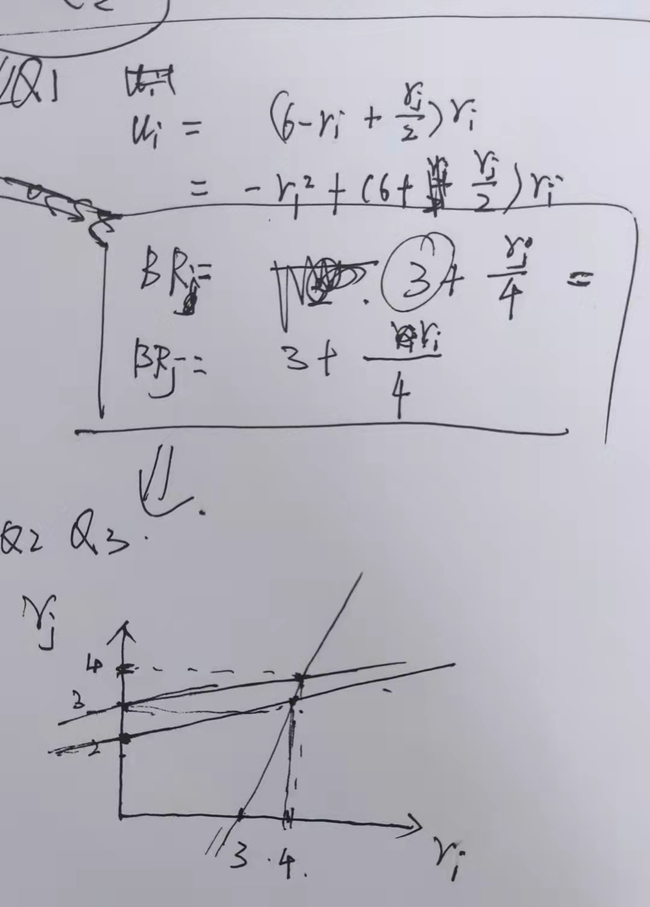

# TODO

1. [x] go through ppt
2. [x] Normal-form Games
3. [ ] Pareto optimal. ???
2. [x] mixed strategy??
2. [x] mixed NE
3. [x] Mixed NE: make opponent indifferent (matrix games only);

# Assignment 2

## 2.1

### Question 1
		Alice	
		C	E
Bob	C	2, 2	-3, 3
	E	3, -3	-2,-2
	
### Question 2

Based on IESDS, for Bob, C is the dominated strategy, so it can be eliminated. The same rule can be applied to Alice. So finally both of them will choose E.

### Question 3 ??

		Alice	
		C	E
Bob	C	2, 2+s	-3+s, 3
	E	3+s, -3	-2,-2+s
	
	
s=1			Alice	
weak dominated			C	E
	Bob	C	2, 3	-2, 3
		E	4, -3	-2,-1
				
s=2			Alice	
			C	E
	Bob	C	2, 4	-1, 3
		E	5, -3	-2,0
		

1. if 0<s<1, NE exists, EE
2. if s=1 or s>1, NE doesn't exist, ??

## 2.2

### Question 1

		        Player1	
		        H	              D
Player2	H	0.5(v-c),0.5(v-c)	v, 0
	D	0, v	0.5v,      0.5v

### Question 2 ?? 

1. if c<v, the NE is HH (single pure NE)
2. if c=v, there is no NE ??

## 2.3 

### Question 1, 2, 3

## 2.4 ??

### 

